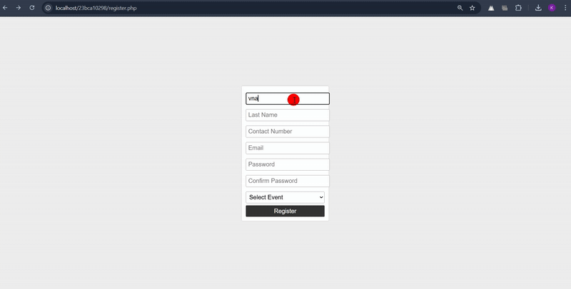

# 23bca10298_php_project

Overview This Event Management System is a PHP-powered web application designed to simplify user registration, authentication, and profile management. With a dynamic and interactive interface, it ensures seamless event participation while maintaining security and validation standards.

Overview This Event Management System is a PHP-powered web application designed to simplify user registration, authentication, and profile management. With a dynamic and interactive interface, it ensures seamless event participation while maintaining security and validation standards.

Key Features

User Registration A simple yet intuitive registration form allows users to sign up with:
Personal Details: First Name, Last Name

Contact Information: Phone Number, Email ID

Account Security: Password & Confirm Password

Event Selection: A dropdown menu with 10+ event options, including Dance, Music, Poetry, Art, etc.

Validation Rules: ✔ Names should contain only letters. ✔ Phone number must be valid and numeric. ✔ Email should follow the correct format. ✔ Passwords must match and meet security criteria. ✔ Event selection is mandatory.

User Login Users can access their accounts using:
Credentials: Email ID & Password

Validation & Redirection: ✔ Ensures correct email format. ✔ Password field cannot be empty. ✔ Successful login redirects users to the Home Page.

Home Page & Profile Management Once logged in, users can:
Upload a Profile Picture

View their registered details (Name, Contact, Email, etc.)

Navigate through an interactive, user-friendly dashboard

Technology Stack Backend: PHP

Database: MySQL

Server: XAMPP / WAMP

How to Set Up & Run Clone the repository to your local system.

Start a local server (XAMPP or WAMP).

Import the provided database file into MySQL.

Run the application in a browser via localhost.
